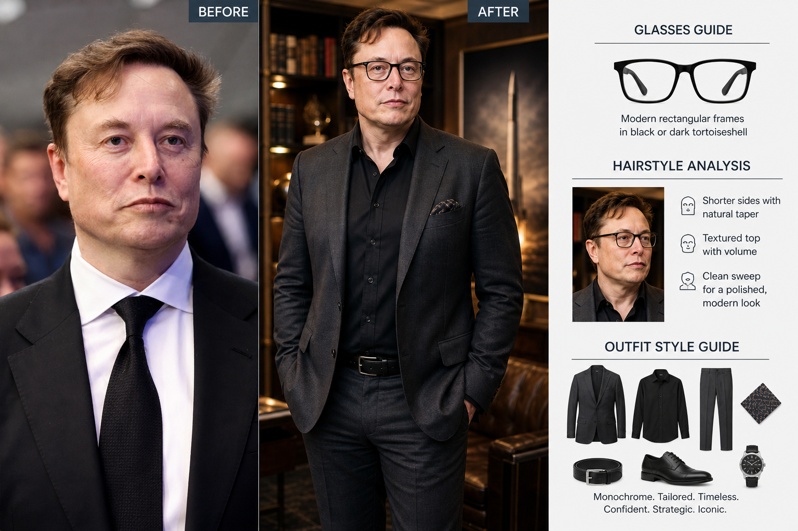
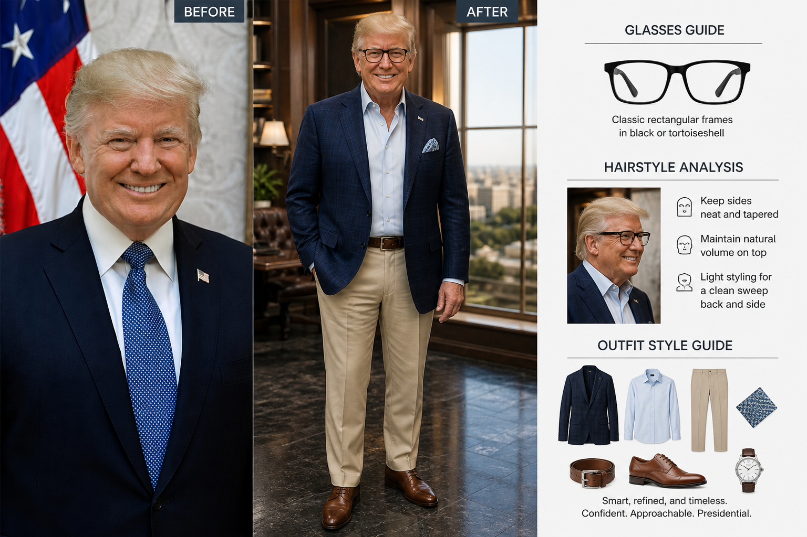
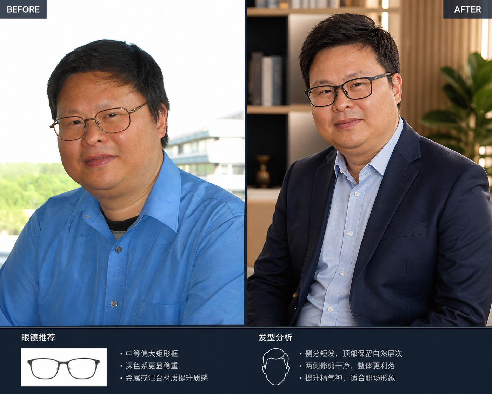
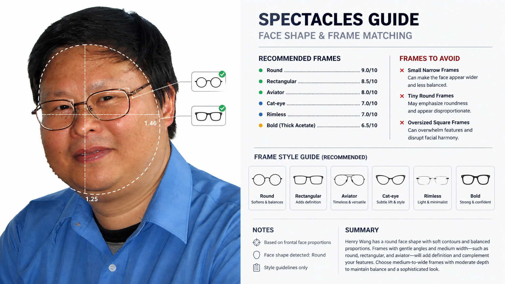
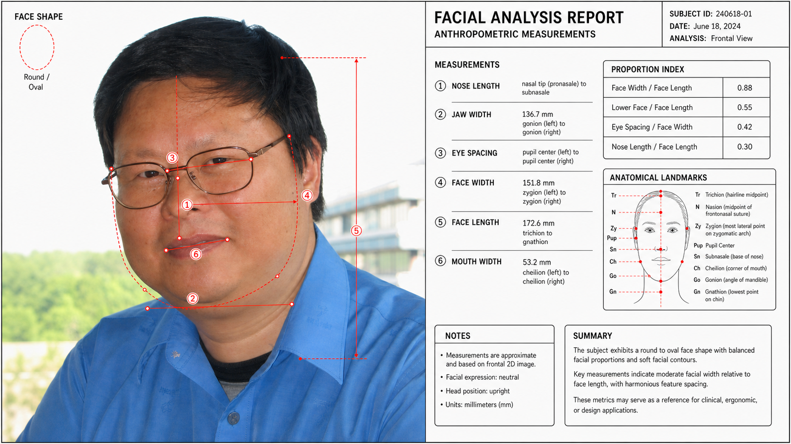
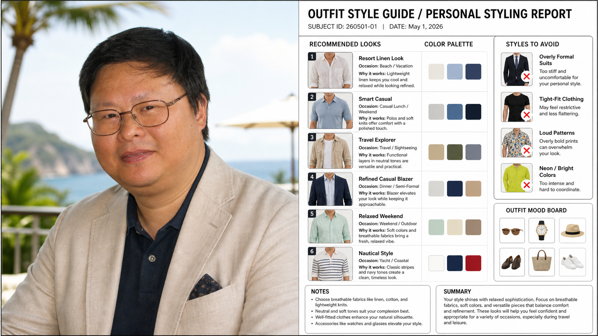

# 🪄 AI Style Analyzer

> **Upload a photo · Select analysis types · Copy the prompt · Get your AI-powered style report in ChatGPT!**
>
> **上传照片 · 选择分析类型 · 复制提示词 · 在 ChatGPT 获取你的 AI 形象报告！**
>
> **写真をアップロード · 分析タイプを選択 · プロンプトをコピー · ChatGPTでAIスタイルレポートを取得！**

---

## 🔗 Live Demo / 在线体验 / ライブデモ

| 地区 / Region | 链接 / Link |
|--------------|------------|
| 🌍 Global (Vercel) | [https://analyzer-amber-eta.vercel.app/](https://analyzer-amber-eta.vercel.app/) |
| 🇨🇳 中国大陆 (腾讯云 EdgeOne) | [https://ai-style-analyzer.edgeone.dev/](https://ai-style-analyzer.edgeone.dev/) |


---

---

## 🎯 Live Demo Results / 真实效果展示 / 実際の結果

> 以下是使用本工具生成的真实 AI 改造效果（综合分析：眼镜+发型+穿搭+配色）
> Real AI transformation using this tool (Combined analysis: Glasses + Hairstyle + Outfit + Color)

### ✨ Tech Entrepreneur Style Transformation



**Analysis Types:** 👓 Glasses Guide + 💇 Hairstyle Analysis + 👗 Outfit Style + 🎨 Color Palette  
**Style Direction:** Monochrome. Tailored. Timeless. Confident. Strategic. Iconic.

**Key Recommendations:**
- **Eyewear:** Modern rectangular frames with clean lines
- **Hairstyle:** Tight sides, textured top with natural volume
- **Outfit:** All-black monochrome, tailored fit, strategic minimalism
- **Color Palette:** Charcoal, slate gray, jet black, cool-toned neutrals

---

### 🎩 Business Professional Style Transformation



**Analysis Types:** 👓 Glasses Guide + 💇 Hairstyle Analysis + 👗 Outfit Style  
**Style Direction:** Smart, refined, and timeless. Confident. Approachable. Presidential.

**Key Recommendations:**
- **Eyewear:** Classic rectangular frames in black or tortoiseshell
- **Hairstyle:** Keep sides neat and tapered, maintain natural volume on top
- **Outfit:** Navy blazer + light blue shirt + khaki pants + brown leather accessories
- **Overall Vibe:** Business casual elegance with approachable confidence

---

> 💡 **Note:** Demo images use publicly available photos of public figures for educational and technical demonstration purposes only. Not endorsed by or affiliated with the individuals shown.
> 
> 💡 **说明：** 演示使用公开照片，仅用于教育和技术展示目的。未经本人授权或代言。
>
> 💡 **注記：** デモ画像は教育および技術デモンストレーション目的でのみ使用されています。本人による推奨や提携はありません。

---


## 🖼️ Sample Output / 效果展示 / サンプル出力

> 以下是使用本工具生成 Prompt 后，在 ChatGPT 中得到的实际报告效果 👇
> Below are real report outputs generated via ChatGPT using this tool's prompts.

### 🧑 Hairstyle Analysis Report / 发型分析报告

> *Face shape detected · Recommended & avoid hairstyles with suitability ratings*

### 🎨 Personal Glass Analysis Report / 个人眼镜分析报告

> *Seasonal glass type · Best & avoid glass with hex codes*

### 🔬 Facial Feature Analysis Report / 面部特征分析报告

> *Anthropometric measurements · Proportion index & face shape diagram*

### 👗 Outfit Style Report / 穿搭风格报告

> *Style archetype · Key pieces assessment & upgrade suggestions*

> 💡 **Tip:** Upload your own photo to get a fully personalized report!
> 💡 **提示：** 上传你自己的照片，即可获得完全个性化的分析报告！

---

## ✨ Features / 功能特色 / 機能

### 🇺🇸 English
- 📸 **Photo Upload** — Click or drag & drop your portrait photo
- 🔬 **8 Analysis Types** — Choose one or multiple at once
- 🎨 **Style Vibe Selector** — Personalize the tone of your report
- 📋 **One-Click Copy** — Copy each generated prompt instantly
- 👁️ **Live Visitor Counter** — Real-time visit tracking
- 🌐 **3 Languages** — English / 中文 / 日本語
- 💡 **No API Key Required** — Works 100% with free ChatGPT

### 🇨🇳 中文
- 📸 **照片上传** — 点击或拖拽上传你的人像照片
- 🔬 **8种分析类型** — 可单选或多选
- 🎨 **风格偏好选择** — 个性化你的分析报告
- 📋 **一键复制** — 即时复制生成的提示词
- 👁️ **实时访问计数** — 实时显示访问量
- 🌐 **三语支持** — English / 中文 / 日本語
- 💡 **无需 API Key** — 配合免费版 ChatGPT 即可使用

### 🇯🇵 日本語
- 📸 **写真アップロード** — クリックまたはドラッグ＆ドロップ
- 🔬 **8種類の分析** — 1つまたは複数選択可能
- 🎨 **スタイルバイブ選択** — レポートのトーンをカスタマイズ
- 📋 **ワンクリックコピー** — 生成したプロンプトを即コピー
- 👁️ **リアルタイム訪問カウンター** — アクセス数をリアルタイム表示
- 🌐 **3言語対応** — English / 中文 / 日本語
- 💡 **APIキー不要** — 無料版ChatGPTで完全動作

---

## 🧠 Analysis Types / 分析类型 / 分析タイプ

| # | 🇺🇸 English | 🇨🇳 中文 | 🇯🇵 日本語 | Description |
|---|------------|---------|-----------|-------------|
| 1 | 🔬 Facial Analysis | 面部特征分析 | 顔の特徴分析 | Proportions & anthropometric measurements |
| 2 | 🎨 Color Analysis | 个人色彩分析 | パーソナルカラー分析 | Seasonal color profiling & skin tone |
| 3 | 👓 Glasses Guide | 眼镜推荐 | メガネガイド | Frame matching by face shape |
| 4 | 💇 Hairstyle Analysis | 发型分析 | ヘアスタイル分析 | Best styles for your face shape |
| 5 | 💪 Physique Analysis | 体型分析 | 体型分析 | Body composition & posture assessment |
| 6 | ✨ Aesthetics Report | 面部美学报告 | 顔の美学レポート | Golden ratio & enhancement suggestions |
| 7 | 👗 Outfit Style Guide | 穿搭风格指南 | コーデスタイルガイド | Clothing & personal style suggestions |
| 8 | 💍 Accessory Guide | 配饰搭配指南 | アクセサリーガイド | Jewelry & accessory pairing |

---

## 📋 Changelog / 更新日志 / 更新履歴

### v1.2.0 — 2026-05-02
- 🌐 Added 3-language support (EN / 中文 / 日本語)
- ✨ Added Outfit Style Guide & Accessory Guide (8 types total)
- 🎨 Upgraded UI to glassmorphism dark theme
- 🇨🇳 Added China mirror via Tencent EdgeOne

### v1.1.0 — 2026-05-01
- ✅ Multi-select analysis types
- ✨ Style Vibe Selector added
- 📊 Live visitor counter integrated
- 🚀 Deployed to Vercel

### v1.0.0 — 2026-05-01
- 🎉 Initial release
- 4 core analysis types
- Basic prompt generation

---

## 🚀 How It Works / 使用方法 / 使い方

### 🇺🇸 English
1. **Upload** your portrait photo
2. **Select** one or more analysis types
3. **Pick** a style vibe direction *(optional)*
4. Click **✨ Generate Prompts**
5. **Copy** the prompt(s)
6. Go to [ChatGPT](https://chat.openai.com) → Upload photo → Paste prompt → Get your report!

### 🇨🇳 中文
1. **上传**你的人像照片
2. **选择**一个或多个分析类型
3. **选择**风格方向（可选）
4. 点击 **✨ 生成提示词**
5. **复制**提示词
6. 前往 [ChatGPT](https://chat.openai.com) → 上传照片 → 粘贴提示词 → 获取专业报告！

### 🇯🇵 日本語
1. 顔写真を**アップロード**
2. 分析タイプを**選択**（複数可）
3. スタイルバイブを**選ぶ**（任意）
4. **✨ プロンプトを生成**をクリック
5. プロンプトを**コピー**
6. [ChatGPT](https://chat.openai.com) へ → 写真をアップロード → プロンプトを貼り付け → レポートを取得！

---

## 🛠️ Tech Stack / 技术栈 / 技術スタック

| Technology | Usage |
|------------|-------|
| [React](https://react.dev/) | UI framework |
| [Vite](https://vitejs.dev/) | Build tool |
| [Vercel](https://vercel.com/) | Global hosting & deployment |
| [Tencent EdgeOne](https://edgeone.ai/) | China-accessible mirror |
| [CounterAPI](https://counterapi.dev/) | Visitor count tracking |

---

## 📦 Local Development / 本地开发 / ローカル開発

```bash
# Clone the repo
git clone https://github.com/YOUR_USERNAME/YOUR_REPO_NAME.git
cd YOUR_REPO_NAME

# Install dependencies
npm install

# Start dev server
npm run dev

# Build for production
npm run build
```

---

## 📁 Project Structure / 项目结构 / プロジェクト構成

```
/
```text
/
├── index.html
├── package.json
├── vite.config.js
├── public/
│   └── screenshots/              # Sample output images
│       ├── elon-demo.png         # Tech entrepreneur demo
│       ├── trump.png             # Business professional demo
│       ├── sample.png            # Hairstyle analysis
│       ├── glass.png             # Glasses guide
│       ├── face.png              # Facial analysis
│       └── outfit.png            # Outfit style
└── src/
    ├── main.jsx
    └── App.jsx                   # Main application component
```

```

---

## 👤 Author / 作者 / 作者

**Henry Wang**
> 🇺🇸 AI enthusiast & content creator. Helping you look your best with AI!
> 🇨🇳 AI 爱好者 & 内容创作者，用 AI 帮你打造最好的自己！
> 🇯🇵 AIエンスージアスト＆コンテンツクリエイター。AIであなたの魅力を最大限に！

| Platform | Link |
|----------|------|
| 📺 YouTube (Main) | [@TubeUnderdeveloped](https://www.youtube.com/@TubeUnderdeveloped) |
| 🎬 YouTube (Animation) | [@DreamWeaveAnimation](https://www.youtube.com/@DreamWeave_Animation) |
| ☕ Buy Me a Coffee | [tubeuchannel](https://www.buymeacoffee.com/tubeuchannel) |

---

## 📢 Advertising / 广告招租 / 広告掲載

> 🇺🇸 Interested in reaching AI & fashion enthusiasts?
> 🇨🇳 想触达 AI 与时尚爱好者？欢迎广告合作！
> 🇯🇵 AI・ファッション愛好家へのリーチをご希望の方はお気軽に！

📧 [zhhwang168@gmail.com](mailto:zhhwang168@gmail.com)

---

## 🌟 Support This Project / 支持本项目 / このプロジェクトをサポート

If you find this tool helpful, consider:
- ⭐ **Star this repo** on GitHub
- ☕ **Buy me a coffee** at [buymeacoffee.com/tubeuchannel](https://www.buymeacoffee.com/tubeuchannel)
- 📢 **Share** with your friends

如果你觉得这个工具有用：
- ⭐ 在 GitHub 上给个 **Star**
- ☕ 请我喝杯咖啡 [buymeacoffee.com/tubeuchannel](https://www.buymeacoffee.com/tubeuchannel)
- 📢 **分享**给你的朋友

このツールが役に立ったら：
- ⭐ GitHubで**スター**をつける
- ☕ コーヒーをおごる [buymeacoffee.com/tubeuchannel](https://www.buymeacoffee.com/tubeuchannel)
- 📢 友達に**シェア**する

---

## 📄 License

MIT License © 2026 Henry Wang

---

<div align="center">

**Made with ❤️ by Henry Wang**

[🌐 Visit App](https://analyzer-amber-eta.vercel.app/) · [🐛 Report Bug](https://github.com/YOUR_USERNAME/YOUR_REPO_NAME/issues) · [💡 Request Feature](https://github.com/YOUR_USERNAME/YOUR_REPO_NAME/issues)

</div>
